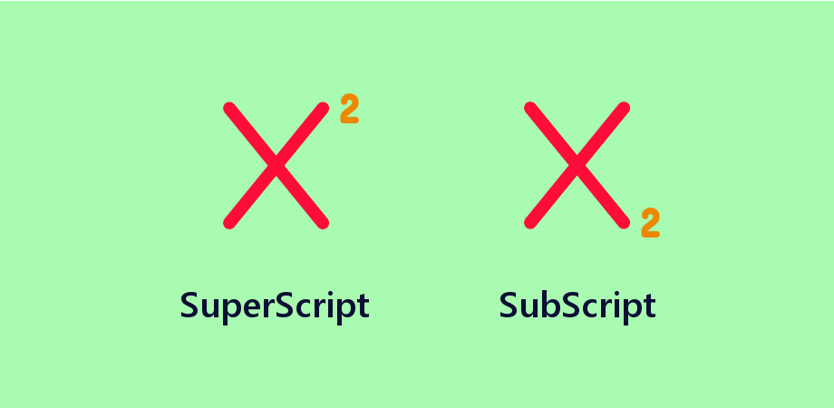

# Class-02 

## Text editting
In HTML we can edit the texts using some tags:
1. Headings: HTML has six "levels" of headings from `<h1>` to `<h6>`
1. Paragraphs: We use `
` to make a paragraph
1. Bold & Italic : We use `<b>Bold</b>` and `<i>Italic</i>`
1. Superscript & Subscrip: We use `` to superscript and `` to subscript 
1. Line Breaks & Horizontal Rules: to go at a new line we use ` ` and  we can add a horizontal rule between sections using the `
`.
1. Strong & Emphasis: The use of the `<strong>` element indicates that its content has strong importance. The `<em>` element indicates emphasis that subtly changes the meaning of a sentence.
1. Quotations: There are two elements commonly used for marking up quotations: `<blockquote>` for longer quotes and `<q>` for shorter quotes.
1. Abbreviations & Acronyms: we use `<abbr>` or `<acronym>` 
1. Citations & Definitions: we use `<cite>` and `<dfn>`
1. Author Details: we use `<address>` to contain contact details for the author of the page.
1. Changes to Content: The `<ins>` element can be used to show content that has been inserted into a document, while the `<del>` element can show text that has been deleted from it. The `<s>` element indicates something that is no longer accurate or relevant.
## Introducing CSS

***CSS Associates Style rules with HTML elements***

CSS works by associating rules with HTML elements. These rules govern how the content of specified elements should be displayed. A CSS rule contains two parts: a selector and a declaration.

***CSS Properties Affect How Elements Are Displayed***

CSS declarations sit inside curly brackets and each is made up of two parts: a property and a value, separated by a colon. You can specify several properties in one declaration, each separated by a semi-colon.

***Using External CSS:***

When we want to use an external CSS file we use this tag `<link href="the path" />`

***Using Internal CSS:***

When we want to use an internal CSS code we use this tag `<style>`

***CSS rules usually appear in a separate document, although they may appear within an HTML page.***

## Basic JS instructions
* STATEMENTS: A script is a series of instructions that a computer can follow one-by-one. Each individual instruction or step is known as a statement. Statements should end with a semicolon. 
* COMMENTS: You should write comments to explain what your code does.

***What's a variable?***

A script will have to temporarily store the bits of information it needs to do its job. It can store this data in variables. 
A variable is a good name for this concept because the data stored in a variable can change (or vary) each time a script runs.

***How to declare the variavles?***

`var quantity`

***How to assign them a value?***

`quantity = 3`

***DATA TYPES:***

1. Numeric
1. String
1. Boolean

***ARRAYS***

An array is a special type of variable. It doesn't just store one value; it stores a list of values. 

***OPERATORS***

* ASSIGNMENT OPERATORS 
* ARITHMETIC OPERATORS 
* STRING OPERATORS 
* COMPARISON OPERATORS 
* LOGICAL OPERATORS 

## Decisions & Loops
Sometimes decisions are made that determine which line of code should be run next.
There are two components to a decision:
1. An expression is evaluated, which returns a value
1. A conditional statement says what to do in a given situation

***Conditional statements*** allow your code to make
decisions about what to do next.

***Comparison operators*** (===, ! ==, ==, ! =, <, >, <=, =>) are used to compare two operands.

***Logical operators*** allow you to combine more than one set of comparison operators.

***if ... else statements*** allow you to run one set of code if a condition is true, and another if it is false. 