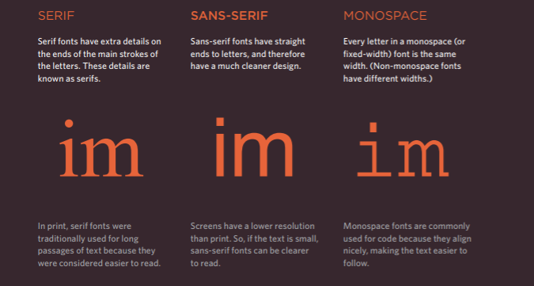
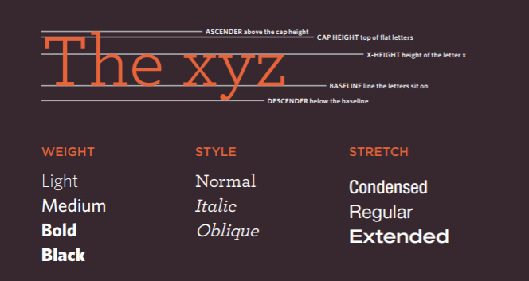

# Class-05

## Images

* How to add images to pages:
To add an image into the page you need to use an `` element. . It must carry the following two attributes: 
   1. src: This tells the browser where it can find the image file
   1. alt: text describes the image if you cannot see it
* Height & Width of Images: This specifies the width & height of the image in pixels.
* Optimizing images for the web: Where you place the image in the code is important because browsers show HTML elements in one of two ways:
   1. Block elements always appear on a new line.
   1. Inline elements sit within a block level element and do not start on a new line.
* You can aligning images horizontally or vertically.
* Three Rules for Creating Images:
   1. Save images in the right format:jpeg, gif, or png format.
   1. Save images at the right size.
   1. Use the correct resolution
* Photographs are best saved as JPEGs; illustrations or logos that use flat colors are better saved as GIFs.

## Color

* How to specify colors: you can specify colors by using one of these ways:
   1. rgb values:how much red, green and blue are used.
   1. hex codes: These are six-digit codes that represent the amount of red, green and blue in a color.
   1. color names: There are 147 predefined color names that are recognized by browsers.

* contrast:When picking foreground and background colors, it is important to ensure that there is enough contrast for the text to be legible.
* Background color: CSS treats each HTML element as if it appears in a box, and the background-color property sets the color of the background for that box. You can specify your choice of background color in the same three ways you can specify foreground colors: RGB values, hex codes, and color names.
* Saturation: Saturation refers to the amount of gray in a color.
* Brightness: Brightness (or "value") refers to how much black is in a color.
* CSS3 has introduced an extra value for RGB colors to indicate opacity. It is known as RGBA.
* CSS3 also allows you to specify colors as HSL values, with an optional opacity value. It is known as HSLA.

## Text

* Typeface Terminology

* Choosing a Typeface for your Website:
When choosing a typeface, it is important to understand that a browser will usually only display it if it's installed on that user's computer.
* Size of Type: The font-size property enables you to specify a size for the font.
* Type Scales: You may have noticed that programs such as Word, Photoshop and InDesign offer the same sizes of text. This is because they are set according to a scale or ratio that was developed by European typographers in the sixteenth century.
* Units of Type Size:
   1. Pixels: Setting font size in pixels is the best way to ensure that the type appears at the size you intended.
   1. Percentages: The default size of text in a web browser is 16 pixels. Using percentages of this amount, you can create a scale where the default text size is 12 pixels, and headings are sized in relation to this.
   1. EMS: Ems allow you to change the size of text relative to the size of the text in the parent element.
* If you want to use a wider range of typefaces there are several options, but you need to have the right license to use them.
* You can control the space between lines of text, individual letters, and words. Text can also be aligned to the left, right, center, or justified. It can also be indented.
* You can use pseudo-classes to change the style of an element when a user hovers over or clicks on text, or when they have visited a link.