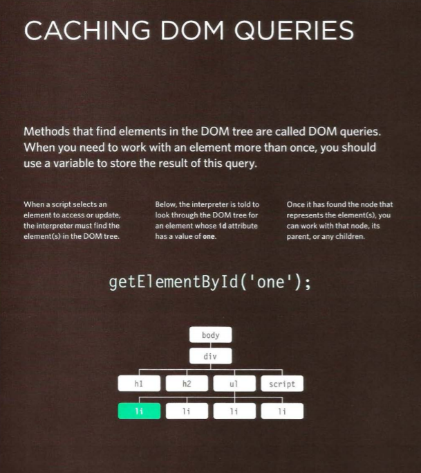

# class-06

### WHAT IS AN OBJECT? 
Objects group together a set of variables and functions to create a model of a something you would recognize from the real world. In an object, variables and functions take on new names.

* Creat an object: we write (var or let ...) following by an object name and equal then we open curly pracets.
* In an object, variables are known as properties of the object; functions are known as methods of the object. 
* The browser represents the page using a DOM tree.
* DOM trees have four types of nodes: document nodes, element nodes, attribute nodes, and text nodes.
* You can select element nodes by their id or cl ass attributes, by tag name, or using CSS selector syntax.
* Whenever a DOM query can return more than one node, it will always return a Nadel list.
* From an element node, you can access and update its content using properties such as textContent and i nnerHTML or using DOM manipulation techniques.
* An element node can contain multiple text nodes and child elements that are siblings of each other.
* In older browsers, implementation of the DOM is inconsistent (and is a popular reason for using jQuery).
* Browsers offer tools for viewing the DOM tree . 

