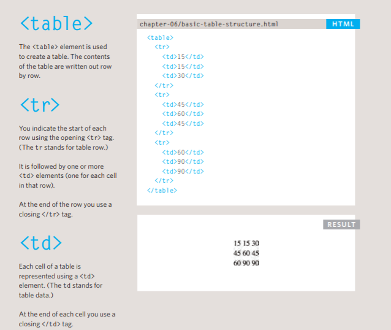
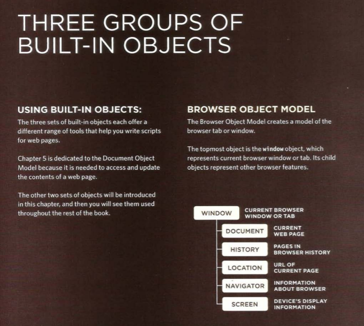

# Class-07

## domain modeling
Domain modeling is the process of creating a conceptual model in code for a specific problem.
### Define a constructor and initialize properties

To define the same properties between many objects, you'll want to use a constructor function. Below is a table that summarizes a JavaScript representation of an `EpicFailVideo` object.

| Property     | Data              | Type    |
|--------------|-------------------|---------|
| `epicRating` | `1` to `10`       | Number  |
| `hasAnimals` | `true` or `false` | Boolean |

## Tables
***What's a Table?*** A table represents information in a grid format. 

### Basic Table Structure

The `<th>` element is used just like the `<td>` element but its purpose is to represent the heading for either a column or a row.
* You can make cells of a table span more than one row or column using the rowspan and colspan attributes.
* For long tables you can split the table into a `<thead>`, `<tbody>`, and `<tfoot>`.
* Traditionally, the term 'form' has referred to a printed document that contains spaces for you to fill in information.

* Creating an object: constructor nation
The new keyword and the object constructor create a blank object.
* To update the value of properties, use dot nation or sequare brackets. `object.name='value'` 
* Arrays are actually a special type of object.
* you can combine arrays and objects to create complex data structures.
***Built-in objects*** 

* You can create an instance of the date object, you can specify the time and date that you want it to represent.
* Functions allow you to group a set of related statements together that represent a single task.
* Functions can take parameters (informatiorJ required to do their job) and may return a value.
* An object is a series of variables and functions that represent something from the world around you.
* In an object, variables are known as properties of the object; functions are known as methods of the object.
* Web browsers implement objects that represent both the browser window and the document loaded into the browser window.
* JavaScript also has several built-in objects such as String, Number, Math, and Date. Their properties and methods offer functionality that help you write scripts.
* Arrays and objects can be used to create complex data sets (and both can contain the other). 