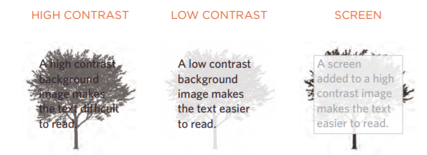
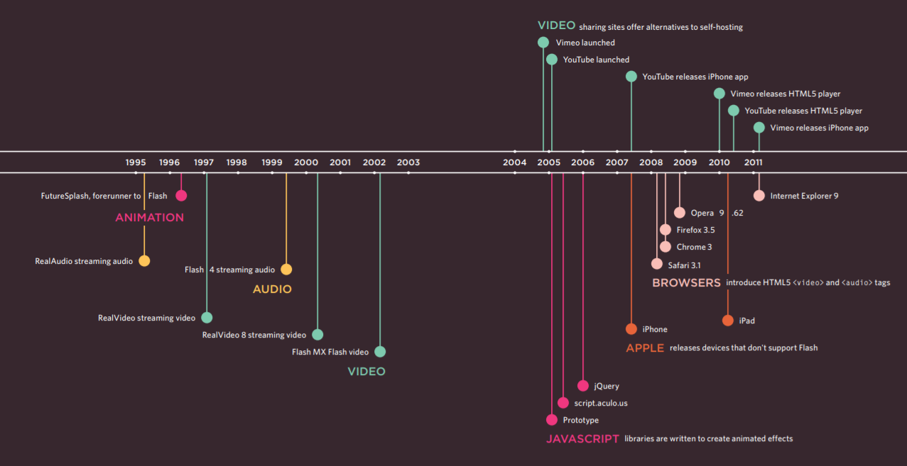

# Read-11

## Images
* Controlling sizes of images in CSS: You can control the size of an image using the width and height properties in CSS.
* AligNing images: the float property can be used to move an element to the left or the right of its containing block.
* Centering images: : 
1. On the containing element, you can use the text-align property with a value of center.
1. On the image itself, you can use the use the margin property and set the values of the left and right margins to auto.
* Background Images: The background-image property allows you to place an image behind any HTML element. This could be the entire page or just part of the page. By default, a background image will repeat to fill the entire box.
1. repeat: The background image is repeated both horizontally and vertically (the default way it is shown if the backgroundrepeat property isn't used)
1. repeat-x: The image is repeated horizontally only (as shown in the first example on the left).
1. repeat-y: The image is repeated vertically only.
1. no-repeat: The image is only shown once. The background-attachment property specifies whether a background image should stay in one position or move as the user scrolls up and down the page. It can have one of two values:
    * fixed: The background image stays in the same position on the page.
    * scroll: The background image moves up and down as the user scrolls up and down the page.

* Background Position: you can use the background-position property to specify where in the browser window the background image should be placed. 
* shorthand: The properties must be specified in the following order, but you can miss any value if you do not want to specify it.
  1. background-color
  1.  background-image
  1. background-repeat
  1. background-attachment
  1. background-position

* Contrast of background images: If you want to overlay text on a background image, the image must be low contrast in order for the text to be legible.

 * To reduce the number of images your browser has to
load, you can create image sprites.

## Practical Information

***Search Engine Optimization (SEO)***
SEO is a huge topic and several books have been written on the subject. 

* The Basics:
Search engine optimization (or SEO) is the practice of trying to help your site appear nearer the top of search engine results when people look for the topics that your website covers.
* On-Page Techniques:
On-page techniques are the methods you can use on your web pages to improve their rating in search engines.
* Off-Page Techniques:
Getting other sites to link to you is just as important as on-page techniques. Search engines help determine how to rank your site by looking at the number of other sites that link to yours.

***On-Page SEO***

1. Page Title
1. URL / Web Address
1. Headings
1. Text
1. Link Text
1. Image Alt Text
1. Page Descriptions

***How to Identify Keywords and Phrases***
Here are six steps that will help you identify the right keywords and phrases for your site.
1. Brainstorm
1. Organize
1. Research
1. Compare
1. Refine
1. MAP

***Analytics: Learning about your Visitors***
As soon as people start coming to your site, you can start analyzing how they found it, what they were looking at and at what point they are leaving. One of the best tools for doing this is a free service offered by Google called Google Analytics.

***How Many People Are Coming to Your Site?***
The overview page gives you a snapshot of the key information you are likely to want to know. In particular, it tells you how many people are coming to your site.

***What Are Your Visitors Looking At?***
The content link on the left-hand side allows you to learn more about what the visitors are looking at when they come to your site.

***Where Are Your Visitors Coming From?***
The traffic sources link on the left hand side allows you to learn where your visitors are coming from.

***Domain Names & Hosting***
* Your domain name is your web address. There are many websites that allow you to register domain names. Usually you will have to pay an annual fee to keep that domain name.
* So that other people can see your site, you will need to upload it to a web server. Web servers are special computers that are constantly connected to the Internet. They are specially set up to serve web pages when they are requested.Types of hosting:
   1. Disk space
   1. Bandwidth
   1. Backups
   1. Email accounts
   1. Server-side languages and databases

***FTP & Third Party Tools***
To transfer your code and images from your computer to your hosting company, you use something known as File Transfer Protocol.
***Many companies provide platforms for blogging, email newsletters, e-commerce and other popular website tools (to save you writing them from scratch).***

## Flash

* How Flash Works: Since the late 1990s, Flash has been a very popular tool for creating animations, and later for playing audio and video in websites.
* Use of Flash: Since 2005, a number of factors have meant that fewer websites are written in Flash or even use elements of Flash in their pages.
* Timeline: Flash, VidEo & Audio
