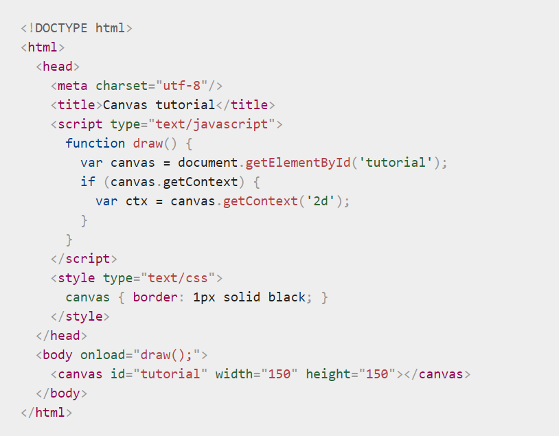

# Read-12

## CHART.JS
Charts are far better for displaying data visually than tables, but they’re not always easy to create.
A great way to get started with charts is with Chart.js, a JavaScript plugin that uses HTML5’s canvas element to draw the graph onto the page.
1. Setting up: The first thing we need to do is download Chart.js.
1. Drawing a line chart.
1. Drawing a pie chart.
1. Drawing a bar chart

***Creating a Chart:*** 
It's easy to get started with Chart.js. All that's required is the script included in your page along with a single `<canvas>` node to render the chart.

***The `<canvas>` element***
The `<canvas>` element has only two attributes, width and height. The element can be sized arbitrarily by CSS, but during rendering the image is scaled to fit its layout size: if the CSS sizing doesn't respect the ratio of the initial canvas, it will appear distorted. the `<canvas>` element requires the closing tag `</canvas>`.
* The <canvas> element creates a fixed-size drawing surface that exposes one or more rendering contexts.

### Drawing shapes with canvas
* The grid (coordinate space): We should specify our reference.
* Drawing rectangles: `<canvas>` only supports two primitive shapes: rectangles and paths 
There are three functions that draw rectangles on the canvas:

`fillRect(x, y, width, height)`
Draws a filled rectangle.
`strokeRect(x, y, width, height)`
Draws a rectangular outline.
`clearRect(x, y, width, height)`
Clears the specified rectangular area, making it fully transparent.

* Drawing paths: A path is a list of points, connected by segments of lines that can be of different shapes, curved or not, of different width and of different color. To make shapes using paths, we take some extra steps:
1. First, you create the path.
1. Then you use drawing commands to draw into the path.
1. Once the path has been created, you can stroke or fill the path to render it.

Here are the functions used to perform these steps:

`beginPath()`
Creates a new path. Once created, future drawing commands are directed into the path and used to build the path up.
`Path methods`
Methods to set different paths for objects.
`closePath()`
Adds a straight line to the path, going to the start of the current sub-path.
`stroke()`
Draws the shape by stroking its outline.
`fill()`
Draws a solid shape by filling the path's content area.

* Moving the pen:
`moveTo(x, y)`
Moves the pen to the coordinates specified by `x` and `y`.
* Lines: For drawing straight lines, use the lineTo() method.
* Arcs: To draw arcs or circles, we use the arc() or arcTo() methods.
* Bezier and quadratic curves:
These are generally used to draw complex organic shapes.

`quadraticCurveTo(cp1x, cp1y, x, y)` 
and 
`bezierCurveTo(cp1x, cp1y, cp2x, cp2y, x, y)`

* Rectangles: To draw rectangular shapes directly to the canvas: `rect(x, y, width, height)`
* Path2D objects: To simplify the code and to improve performance, the Path2D object, available in recent versions of browsers, lets you cache or record these drawing commands. You are able to play back your paths quickly.

## Applying styles and colors
* Colors:
If we want to apply colors to a shape, there are two important properties we can use:
1. `fillStyle = color`
Sets the style used when filling shapes.
1. `strokeStyle = color`
Sets the style for shapes' outlines.
* Transparency: 
`globalAlpha = transparencyValue`
Applies the specified transparency value to all future shapes drawn on the canvas.
* Line styles: 
There are several properties which allow us to style lines.

  1. `lineWidth = value`
Sets the width of lines drawn in the future.
  1. `lineCap = type`
Sets the appearance of the ends of lines.
  1. `lineJoin = type`
Sets the appearance of the "corners" where lines meet.
  1. `miterLimit = value`
Establishes a limit on the miter when two lines join at a sharp angle, to let you control how thick the junction becomes.
  1. `getLineDash()`
Returns the current line dash pattern array containing an even number of non-negative numbers.
  1. `setLineDash(segments)`
Sets the current line dash pattern.
  1. `lineDashOffset = value`
Specifies where to start a dash array on a line.
* Shadows
Using shadows involves just four properties:

  1. shadowOffsetX = float
Indicates the horizontal distance the shadow should extend from the object. This value isn't affected by the transformation matrix. The default is 0.
  1. shadowOffsetY = float
Indicates the vertical distance the shadow should extend from the object. This value isn't affected by the transformation matrix. The default is 0.
  1. shadowBlur = float
Indicates the size of the blurring effect; this value doesn't correspond to a number of pixels and is not affected by the current transformation matrix. The default value is 0.
  1. shadowColor = color
A standard CSS color value indicating the color of the shadow effect; by default, it is fully-transparent black.
## Drawing text
The canvas rendering context provides two methods to render text:
* fillText(text, x, y [, maxWidth])
* strokeText(text, x, y [, maxWidth])

***Styling text***
There are some more properties which let you adjust the way the text gets displayed on the canvas:
* `font = value`
* `textAlign = value`
* `textBaseline = value`
* `direction = value`

***Advanced text measurements***
In the case you need to obtain more details about the text, the following method allows you to measure it.

`measureText()`
Returns a `TextMetrics` object containing the width, in pixels, that the specified text will be when drawn in the current text style.
