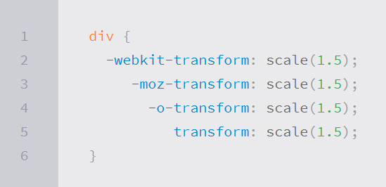
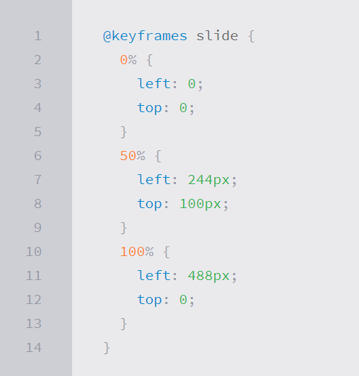

# Read-14

[Go to read about workin teams in class-15](https://ishaqalathamneh.github.io/reading-notes/201reading-notes/class-15)

### Transforms
With CSS3 came new ways to position and alter elements. Now general layout techniques can be revisited with alternative ways to size, position, and change elements. All of these new techniques are made possible by the transform property.

***Transform Syntax***

### 2D Transforms

***2D Rotate***
The transform property accepts a handful of different values. The rotate value provides the ability to rotate an element from 0 to 360 degrees.

***2D Scale***
Using the scale value within the transform property allows you to change the appeared size of an element. The default scale value is 1, therefore any value between .99 and .01 makes an element appear smaller while any value greater than or equal to 1.01 makes an element appear larger. t is possible to scale only the height or width of an element using the scaleX and scaleY values.

***2D Translate***
The translate value works a bit like that of relative positioning, pushing and pulling an element in different directions without interrupting the normal flow of the document. Using the translateX value will change the position of an element on the horizontal axis while using the translateY value will change the position of an element on the vertical axis.

***2D Skew***
The last transform value in the group, skew, is used to distort elements on the horizontal axis, vertical axis, or both.
### Combining Transforms
It is common for multiple transforms to be used at once, rotating and scaling the size of an element at the same time for example. In this event multiple transforms can be combined together. To combine transforms, list the transform values within the transform property one after the other without the use of commas.

### Transitions & Animations
One evolution with CSS3 was the ability to write behaviors for transitions and animations. Front end developers have been asking for the ability to design these interactions within HTML and CSS, without the use of JavaScript or Flash, for years. Now their wish has come true.

***Transitions***

* As mentioned, for a transition to take place, an element must have a change in state, and different styles must be identified for each state. The easiest way for determining styles for different states is by using the :hover, :focus, :active, and :target pseudo-classes.
* There are four transition related properties in total, including transition-property, transition-duration, transition-timing-function, and transition-delay. Not all of these are required to build a transition, with the first three are the most popular.

***Animations***
Transitions do a great job of building out visual interactions from one state to another, and are perfect for these kinds of single state changes. However, when more control is required, transitions need to have multiple states. In return, this is where animations pick up where transitions leave off.

***Animations Keyframes***
To set multiple points at which an element should undergo a transition, use the @keyframes rule. The @keyframes rule includes the animation name, any animation breakpoints, and the properties intended to be animated.

#### 8 SIMPLE CSS3 TRANSITIONS THAT WILL WOW YOUR USERS
1. Fade in
1. Change color
1. Grow & Shrink
1. Rotate elements
1. Square to circle
1. 3D shadow
1. Swing
1. Inset border

[You can read about them in details by clicking here.](https://www.webdesignerdepot.com/2014/05/8-simple-css3-transitions-that-will-wow-your-users)
