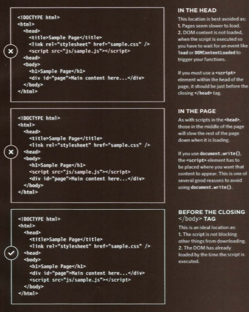

# Read-02

#### JQUERY
jQuery offers a simple way to achieve a variety of common JavaScript tasks quickly and consistently, across all major browsers and without any fallback code needed.
#### What's JQUERY?
jQuery is a javascript file thet you include in your web pages.
#### WHY USE JQUERY?
jQuery doesn't do anything you cannot achieve with pure JavaScript. It is just a JavaScript file but estimates show it has been used on over a quarter of the sites on the web, because it makes coding simpler. 
#### a Matched set/jQuery Selection
When you select one or more elements, a jQuery object is reTurned. It is also known as a matched set or a jquery selection.
#### Get & Set Data
1. To select an element `$('selector')`
1. To update data: `$('selector').html('updated')` and you can use `text` rather than `html`.

***When you create a selection with jQuery, it stores a reference to the corresponding nodes in the DOM tree. It does not create copies of them.***

#### Checking
`jQuery.ready()` method checks that the page is ready for your code to work with.

#### Ways to include jQuery in your page
you can host the jQuery file in your website or use a version that hosted by other companies.

#### Pair Programming
1. Greater efficiency
1. Engaged collaboration
1. Learning from fellow students
1. Social skills
1. Job interview readiness
1. Work environment readiness