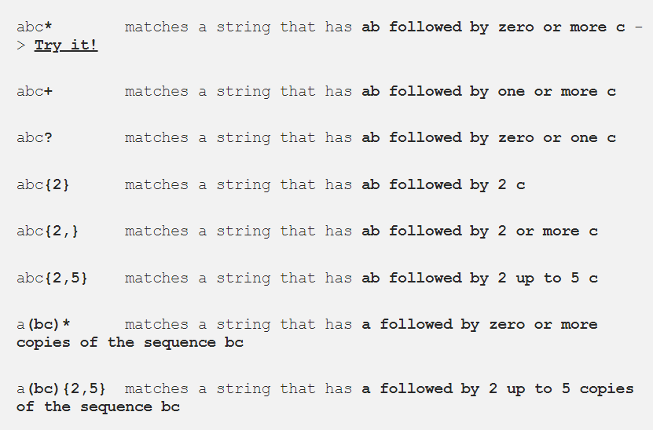

# Read-04 

## Regex

### Regex tutorial — A quick cheatsheet by examples
Regular expressions (regex or regexp) are extremely useful in extracting information from any text by searching for one or more matches of a specific search pattern
Fields of application range from validation to parsing/replacing strings, passing through translating data to other formats and web scraping.
#### Anchors — ^ and $
* `^The        matches any string that starts with The`
* `end$        matches a string that ends with end`
* `^The end$   exact string match (starts and ends with The end)`
* `roar        matches any string that has the text roar in it`

#### Quantifiers — * + ? and {}

#### OR operator — | or []
* `a(b|c)     matches a string that has a followed by b or c (and captures b or c)`
* `a[bc]      same as previous, but without capturing b or c`

#### Character classes — \d \w \s and .
* `\d         matches a single character that is a digit`
* `\w         matches a word character (alphanumeric character plus underscore) ->`
* `\s         matches a whitespace character (includes tabs and line breaks)`
* `.          matches any character`

#### Flags
A regex usually comes within this form `/abc/`, where the search pattern is delimited by two slash characters `/`.
* g (global) does not return after the first match, restarting the subsequent searches from the end of the previous match.
* m (multi-line) when enabled `^` and `$` will match the start and end of a line, instead of the whole string.
* i (insensitive) makes the whole expression case-insensitive(for instance `/aBc/` i would match `AbC`).

#### Grouping and capturing — ()
* `a(bc)           parentheses create a capturing group with value bc`
* `a(?:bc)*        using ?: we disable the capturing group`
* `a(?<foo>bc)     using ?<foo> we put a name to the group`
This operator is very useful when we need to extract information from strings or data using your preferred programming language. Any multiple occurrences captured by several groups will be exposed in the form of a classical array: we will access their values specifying using an index on the result of the match.
#### Bracket expressions — []
* `[abc]            matches a string that has either an a or a b or a c -> is the same as a|b|c`
* `[a-c]            same as previous`
* `[a-fA-F0-9]      a string that represents a single hexadecimal digit, case insensitively`
* `[0-9]%           a string that has a character from 0 to 9 before a % sign`
* `[^a-zA-Z]        a string that has not a letter from a to z or from A to Z. In this case the ^ is used as negation of the expression`
#### Greedy and Lazy match
* `<.+?>            matches any character one or more times included inside < and >, expanding as needed`
* `<[^<>]+>         matches any character except < or > one or more times included inside < and >`
#### Boundaries — \b and \B
* `\babc\b          performs a "whole words only" search`
* `\Babc\B          matches only if the pattern is fully surrounded by word characters`

#### Back-references — \1
* `([abc])\1              using \1 it matches the same text that was matched by the first capturing group`
* `([abc])([de])\2\1      we can use \2 (\3, \4, etc.) to identify the same text that was matched by the second (third, fourth, etc.) capturing group`
* `(?<foo>[abc])\k<foo>   we put the name foo to the group and we reference it later (\k<foo>). The result is the same of the first regex`
#### Look-ahead and Look-behind — (?=) and (?<=)
* `d(?=r)       matches a d only if is followed by r, but r will not be part of the overall regex match`
* `(?<=r)d      matches a d only if is preceded by an r, but r will not be part of the overall regex match`
* `d(?!r)       matches a d only if is not followed by r, but r will not be part of the overall regex match`
* `(?<!r)d      matches a d only if is not preceded by an r, but r will not be part of the overall regex match`

#### Summary
* data validation (for example check if a time string i well-formed)
* data scraping (especially web scraping, find all pages that contain a certain set of words eventually in a specific order)
* data wrangling (transform data from “raw” to another format)
* string parsing (for example catch all URL GET parameters, capture text inside a set of parenthesis)
* string replacement (for example, even during a code session using a common IDE to translate a Java or C# class in the respective JSON object — replace “;” with “,” make it lowercase, avoid type declaration, etc.)
* syntax highlightning, file renaming, packet sniffing and many other applications involving strings (where data need not be textual)

#### Reference
[Factory Mind](https://medium.com/factory-mind/regex-tutorial-a-simple-cheatsheet-by-examples-649dc1c3f285)