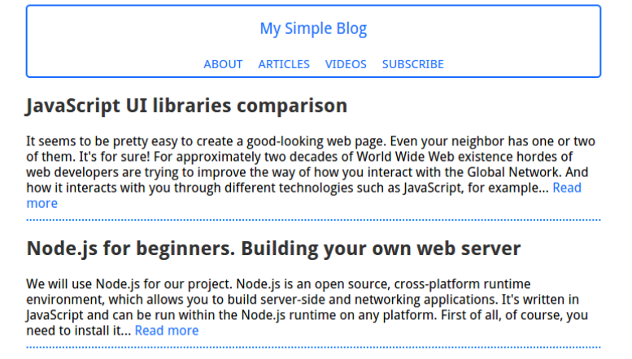

# Read-05

## Heroku
It's a language to write and deploy a code by some orders

## Node.js For Beginners. Deploy Your Blog to Heroku
We will use Node.js for our project. Node.js is an open source, cross-platform runtime environment, which allows you to build server-side and networking applications.

***Pretty simple, but it's a server!***

`var http = require("http");`

`http.createServer(function(request, response) {`

  `response.writeHead(200, {"Content-Type": "text/plain"});`

  `response.write("It's alive!");`

  `response.end();`

`}).listen(3000);`

Run at your terminal:

`node server.js`

## Make it worldwide
Works fine. But it works locally. WWW is for "World Wide Web" and we will turn your local server into a world wide server. We'll use Heroku cloud application platform for this. Heroku is a cloud platform as a service (cool long-bearded programmer guys call such type of things "PaaS"). It allows you to deploy your web server, so everyone could see how awesome you are as a web developer.

### Look, mom! I'm developing!
First of all, let's declare some variables:

`var http = require("http");`
`var fs = require("fs");`
`var path = require("path");`
`var mime = require("mime");`

Create the package.json file and fill it with proper information.

Just run:

`npm install`

We will now create send404() function. It will handle the sending of 404 error, which usually appears when requested file doesn't exist:

`function send404(response) {`
`response.writeHead(404, {"Content-type" : "text/plain"});`
  `response.write("Error 404: resource not found");`
  `response.end();}`

Now we will define sendPage() function.

`function sendPage(response, filePath, fileContents) {`
  `response.writeHead(200, {"Content-type" : mime.lookup(path.basename(filePath))});`
  `response.end(fileContents);}`

  Now we'll define how our server will handle responses. This function will return the content of the requested file or the 404 error otherwise:

  `function serverWorking(response, absPath) {`
  `fs.exists(absPath, function(exists) {`
    `if (exists) {`
      `fs.readFile(absPath, function(err, data) {`
        `if (err) {`
          `send404(response)`
        `} else {`
          `sendPage(response, absPath, data);}`
      `});`
    `} else {`
      `send404(response);}`
  `});}`

  And now it's time to create the HTTP server:

`  var server = http.createServer(function(request, response) {`
`  var filePath = false;`

`  if (request.url == '/') {`
`    filePath = "public/index.html";`
`  } else {`
`    filePath = "public" + request.url;}`
 ` var absPath = "./" + filePath;`
  `serverWorking(response, absPath);});`

  Now we need to start our server.

  `http.createServer(<some code here>).listen(3000)`

  We can do it when we run our server locally.

  `var port_number = server.listen(process.env.PORT || 3000);`

  We need to create the index.html file. It will determine our blog's exterior. Here's the code:

  And After this we complete the demo It should be like this

  