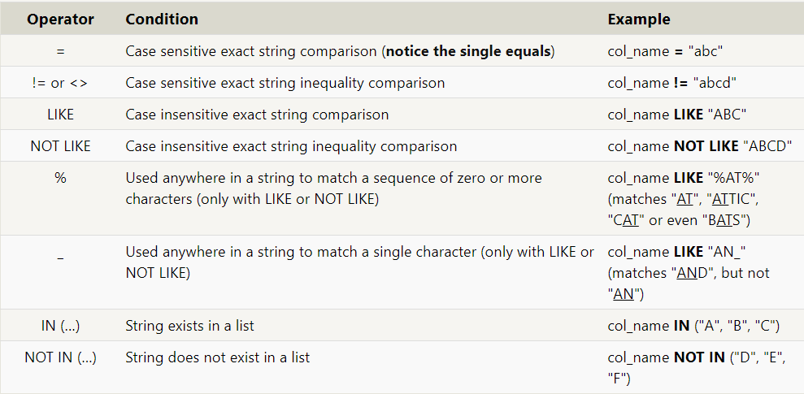

# Read-08: SQL & DataBase

### SQL
SQL, or Structured Query Language, is a language designed to allow both technical and non-technical users query, manipulate, and transform data from a relational database. And due to its simplicity, SQL databases provide safe and scalable storage for millions of websites and mobile applications.

***Relational databases:*** A relational database represents a collection of related (two-dimensional) tables. Each of the tables are similar to an Excel spreadsheet, with a fixed number of named columns and any number of rows of data.

***Collect from SQL:*** To retrieve data from a SQL database, we need to write SELECT statements, 
```
SELECT column, another_column, …
FROM mytable;
```
* The result of this query will be a two-dimensional set of rows and columns, effectively a copy of the table, but only with the columns that we requested. We can select all columns by write `SELECT *`.

***Conditions:*** In order to filter certain results from being returned, we need to use a WHERE clause in the query.
```
SELECT column, another_column, …
FROM mytable
WHERE condition
    AND/OR another_condition
    AND/OR …;
```
For Example: `num_wheels >= 4 AND doors <= 2`.

When writing WHERE clauses with columns containing text data, SQL supports a number of useful operators to do things like case-insensitive string comparison and wildcard pattern matching. We show a few common text-data specific operators below:



***Filtering and sorting Query results***:
* SQL provides a convenient way to discard rows that have a duplicate column value by using the DISTINCT keyword.
```
SELECT DISTINCT column, another_column, …
FROM mytable
WHERE condition(s);
```
* SQL provides a way to sort your results by a given column in ascending or descending order using the ORDER BY clause.
```
SELECT column, another_column, …
FROM mytable
WHERE condition(s)
ORDER BY column ASC/DESC;
```

***Limiting results to a subset***
Another clause which is commonly used with the ORDER BY clause are the LIMIT and OFFSET clauses, which are a useful optimization to indicate to the database the subset of the results you care about.
The LIMIT will reduce the number of rows to return, and the optional OFFSET will specify where to begin counting the number rows from.
```
SELECT column, another_column, …
FROM mytable
WHERE condition(s)
ORDER BY column ASC/DESC
LIMIT num_limit OFFSET num_offset;
```
***Inserting new data***
When inserting data into a database, we need to use an INSERT statement, Its syntax:
```
INSERT INTO mytable
VALUES (value_or_expr, another_value_or_expr, …),
       (value_or_expr_2, another_value_or_expr_2, …),
       …;
```
For more information you can look at [SQL Cheat Sheet](http://www.cheat-sheets.org/sites/sql.su/).