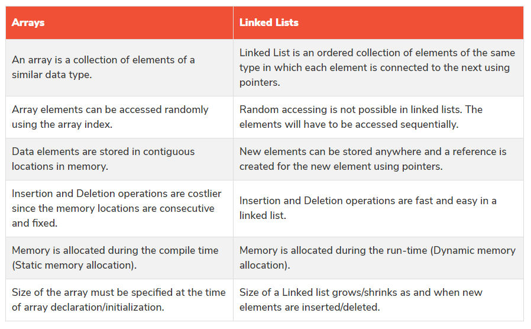

# Linked list

* A Linked List is a sequence of Nodes that are connected/linked to each other. The most defining feature of a Linked List is that each Node references the next Node in the link.
* There are two types of Linked List - Singly and Doubly. We will be implementing a Singly Linked List in this implementation.

# Array Vs Linked list

