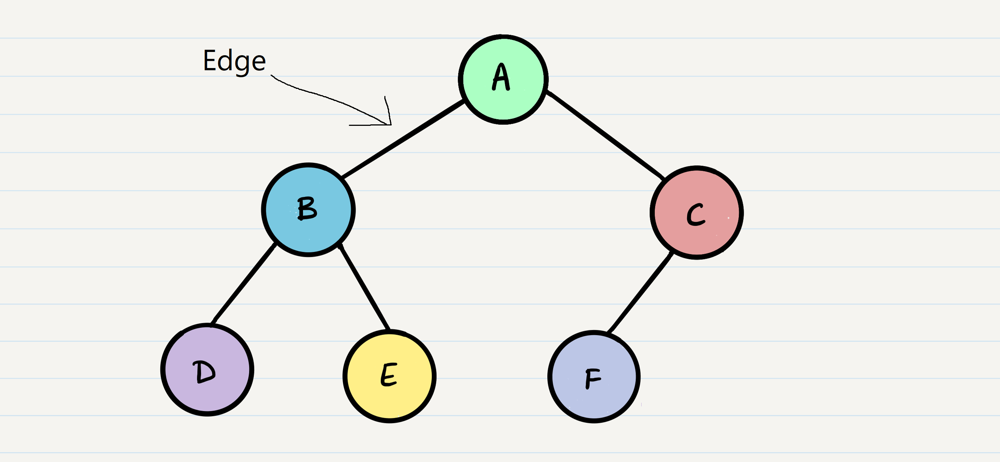

# Class 15 Trees

* Node - A Tree node is a component which may contain it’s own values, and references to other nodes
* Root - The root is the node at the beginning of the tree
* K - A number that specifies the maximum number of children any node may have in a k-ary tree. In a binary tree, k = 2.
* Left - A reference to one child node, in a binary tree
* Right - A reference to the other child node, in a binary tree
* Edge - The edge in a tree is the link between a parent and child node
* Leaf - A leaf is a node that does not have any children
* Height - The height of a tree is the number of edges from the root to the furthest leaf

1. Depth First
    * Pre-order: `root >> left >> right` ---> `A, B, D, E, C, F`
    * In-order: `left >> root >> right` ---> `D, B, E, A, F, C`
    * Post-order: `left >> right >> root` ---> `D, E, B, F, C, A`
1. Breadth First
    * Output: `A, B, C, D, E, F`

* Root: `A`
* K: `2`
* Leaf: `D, E, F`
* Height: `2`